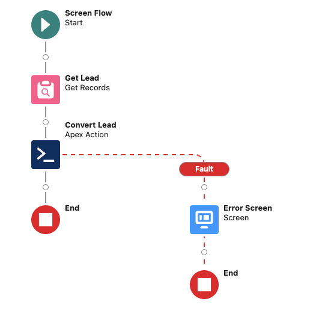
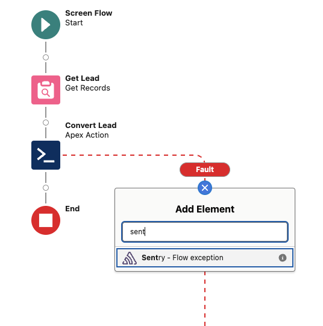
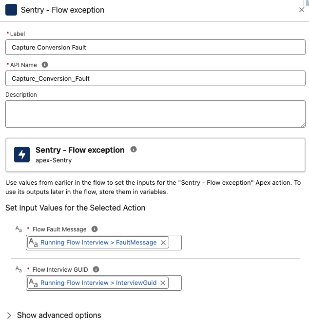

# Usage in Flows

## Sample existing flow

In this example, we will track issues that could occur in a custom lead conversion flow.

Your flow should look something like this.

> You do use fault path and screens to display what went wrong, right? ;)

## Adding a Sentry Element

