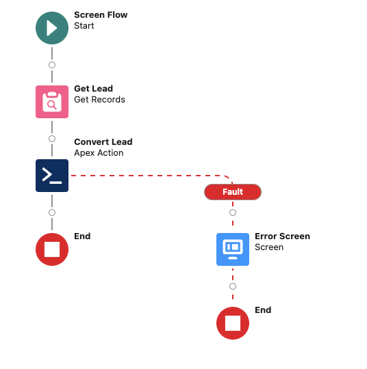
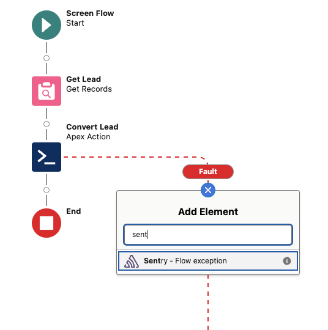
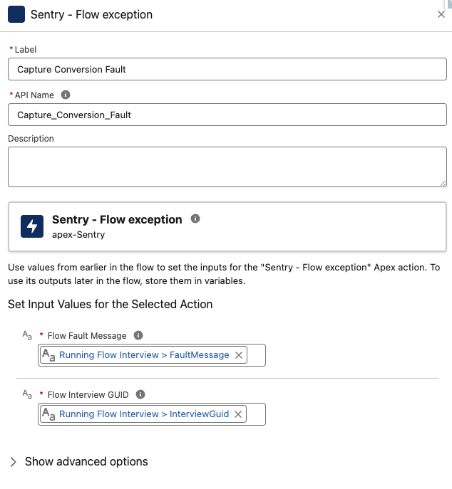

# Usage in Flows

## Sample existing flow

In this example, we will track issues that could occur in a custom lead conversion flow.

Your flow should already have a fault path that routes errors to a screen or message element — Sentry reporting hooks into that same path.

## Adding a Sentry element

In the Flow Builder palette, search for **Capture Sentry Event**. Drag it onto the canvas and connect it from the fault path of any element you want to monitor.

## Configuring the element

Set the **Error Message** input to the fault variable you want to capture (typically `{!$Flow.FaultMessage}`). The element will serialize the fault context and send it to Sentry automatically.

After adding the Sentry element, your fault path should look like:

1. **Fault connector** → Sentry element (captures the error)
2. Sentry element → your existing error screen / toast element (shows the error to the user)

This way, errors are both reported to Sentry and surfaced to the user.
