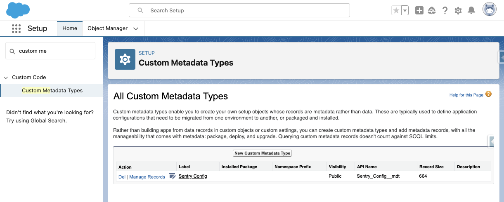
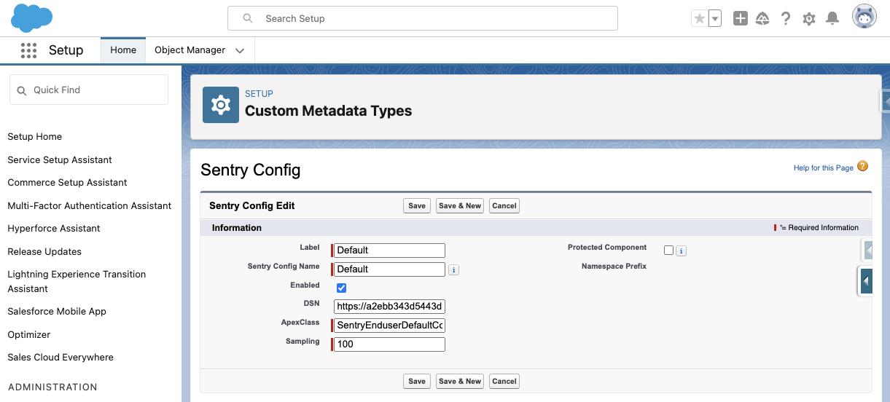

# Installation

## Package installation

Install this package with this [link](https://login.salesforce.com/packaging/installPackage.apexp?p0=04tQy0000002NOjIAM)

## Base configuration

### Add a custom metadata record

In setup, search for `Custom Metadata Types`

Click on `Manage Records` next to `Sentry Config`, then new.

Note :

- you may have several records for this custom metadata but only one should be active
- You may name those records anyway you like
- DSN should be your Sentry project DSN
- Apexclass must be a class implementing `ISentryConfig`, we provide `SentryEnduserDefaultConfig` as a default to help you get started.
- Sampling must be between 0 and 100, defines what percentage of events are sent to sentry.

### Add a remote site

In setup, search for `Remote Site Settings`, then click `New Remote Site`.
Name it `Sentry` and for URL, it should be `https://o<somenumber>.ingest.sentry.io`.
The ingest URL can be found from your DSN.
