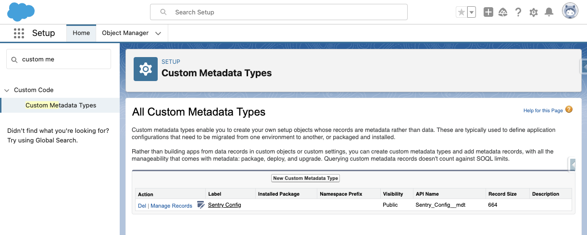
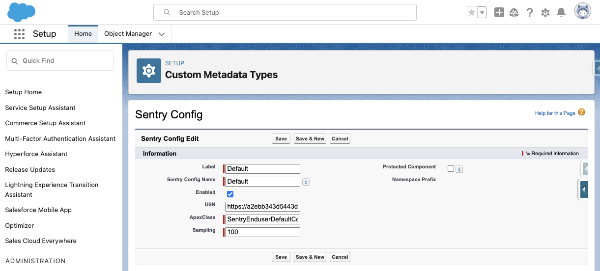

# Installation

## 1. Install the managed package

**[Install v0.5 (latest)](https://login.salesforce.com/packaging/installPackage.apexp?p0=04tQy000000VcSPIA0)**

For previous versions, see the [Changelog](/changelog).

## 2. Configure and instrument your project

### Option A — CLI (recommended)

The `@salesforce-sentry/codemods` CLI handles the entire setup in three commands. Run them from your SFDX project root.

**Generate config files:**

```bash
npx @salesforce-sentry/codemods setup
```

This prompts for your DSN, class name, sampling rate, and integrations, then writes:

- An Apex config class extending `sentrysdk.SentryConfig`
- A `sentrysdk__Sentry_Config.Default` custom metadata record
- A `Sentry` remote site setting

**Instrument your code:**

```bash
npx @salesforce-sentry/codemods adopt
```

Scans your project and wraps LWC components and Apex entry points with Sentry error capture. Shows a diff and prompts before each change.

**Verify everything is wired up:**

```bash
npx @salesforce-sentry/codemods validate
```

**Deploy:**

```bash
sf project deploy start
```

---

### Option B — Manual setup

#### Add a custom metadata record

In Setup, search for `Custom Metadata Types`.



Click `Manage Records` next to `Sentry Config`, then `New`.



- Only one record should be active at a time
- **DSN** — your Sentry project DSN
- **ApexClass** — a class extending `sentrysdk.SentryConfig`; `SentryEnduserDefaultConfig` is provided as a default
- **Sampling** — 0 to 100

#### Add a remote site setting

In Setup, search for `Remote Site Settings`, then `New Remote Site`.
Name it `Sentry`. For URL, use `https://o<number>.ingest.sentry.io` (the host part of your DSN).
