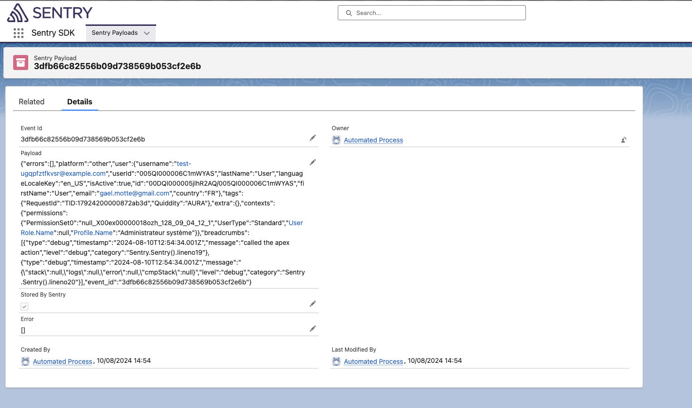

# Viewing raw captured events

In order to troubleshoot any integration issue with Sentry, you may assign the following permissions sets to the admins :

- `Sentry Logs Inspector`
- `Sentry Admin`

Those give access to a custom Application named `SentrySDK` and a custom object listing the events sent to sentry

